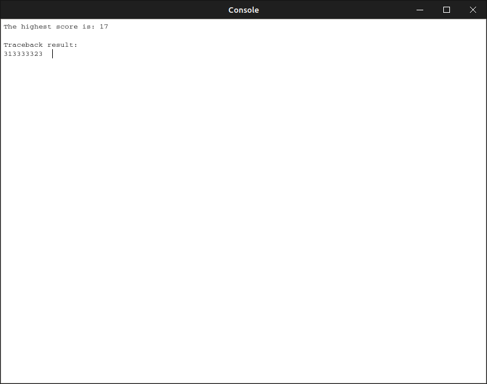
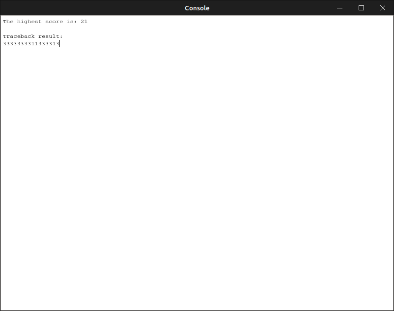

# Computer Architecture HW2 Report

## Screenshots

- testing_data #1

- testing_data #2

## Design

我把這次的程式分成三大塊。因為沒有用到遞迴所以沒有寫成 function ，等於直接寫在 `int main()` 裡面。

### 計算 score, dir ，同時紀錄最大 score 以及位置

大致上就是兩層 for 迴圈，由 row-major 的順序去填 score 和 dir。

值得注意的是在上、左兩格 score 相等的時候，我會把方向寫成 ↑。並且在 match/mismatch 與 gap 相等的時候選擇 ↖，採用(3 > 2 > 1)的順序。當三個 score 都小於 0 的時候我會把 dir 存成 0，這樣就可以單憑 dir matrix 做 backtrace，不必再讀 score 的資料(一開始 dir 全部都填 0，所以 i == 0 或 j == 0 的時候 dir 也保證是 0)。

在每次 iteration 填完 score 之後就可以跟存在 register 的最大值比較，這樣就不用再多 O(n) 的 for loop 找最大值。

遇到最大值的時候會紀錄最大的 score 和其所在的 memory address，方便 print 最大值和 backtrace。

### 印出最大值

這裡只需要 O(1) 印出前面紀錄的最大值和字串就可以了。

### Backtrace 並印出方向

因為前面把 score == 0 的 direction 存成 0，所以 while loop 的中止條件是 direction == 0 的時候結束。
接著只要 print 出 direction matrix 的值，並且根據其值移動 offset，直到 while 結束就可以了。

## Usage

把兩行 `######################################################` 中間的部份換掉， seq1, seq2 存兩個字串，score 和 dir 必須是 `(seq1.length() + 1) * (seq2.length() + 1)` 大小的陣列（程式裡面預設每個數字是 `int`，大小是 4），且必須初始化為 0。最後在 `$s0`, `$s1` 分別放 seq1, seq2 的長度。

做完上面的事情之後就可以丟到 QTspim 裡面跑了。
