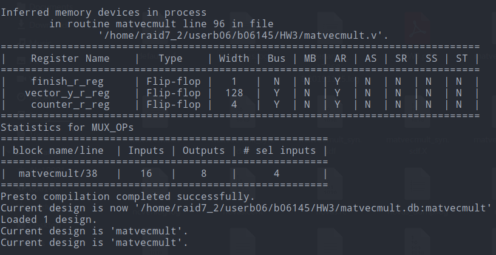

B06901145 李子筠

## HW3 report

### Snapshot

#### rtl_tb1

#### rtl_tb2

#### gatelevel_tb1

#### gatelevel_tb2

#### no latch

#### Timing report

#### Area report

### Design

我的寫法基本上就只是改 metvec2x2.v，只是改成 for loop 和乘2 再加上 vector b，把所有 size 調成 4x4 需要的大小。

### 心得

這是我第一次寫 verilog，一開始花了蠻多時間看各個語法和模擬工具，最後才發現有提供寫好的 .cshrc 可以直接設定環境。

除了環境之外，在寫得過程中不小心把 `counter_w = counter_r + 1'b1` 放到 if else 外面，結果 RTL 跑出來是對的，但 gate level tb2 跑出來是錯的。為了解決這個問題用 nWave 看了很久，最後才發現錯誤。

在用 nWave 看合成出來的 gate level 的時候，發現合成出來的元件很多，不太知道要改動哪裡才會更好，所以沒有想到如何改進。